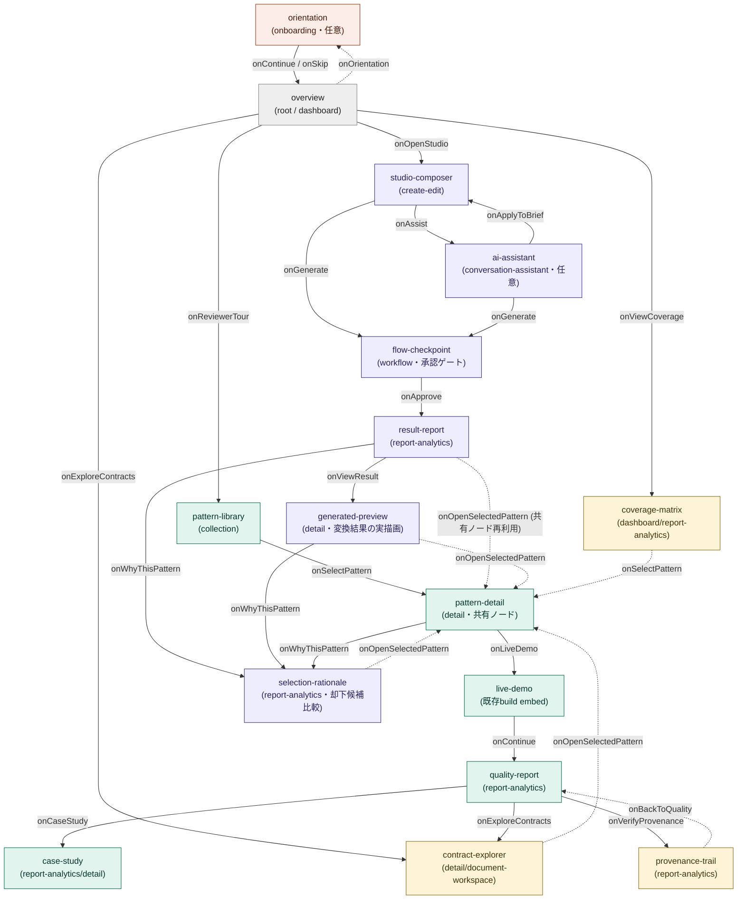

```
encoding:'UTF-8'
```

Brief
プロダクト名（仮）: AI Design System Studio
目的:
briefからJTBD、FlowSpec、パターン選定、実装、検証までを、動く画面とともに説明する公開ポートフォリオ。

Storybookは部品単位の実験室として残し、本体アプリは統合された体験、選定理由、ケーススタディを見せる場所にします。
対象者は次の3者です。
3〜5分で候補者を評価する採用担当者
画面・ブロックの再利用性を確認するデザイナー／開発者
AI実装の契約と品質保証を確認する技術評価者
JTBD
短時間でプロジェクトの独自性を理解する
画面・ブロックパターンを実例から探索する
briefがUIへ変換される工程を体験する
品質や完成度の主張を検証する
機能分解
P0のポートフォリオ本体:
コンセプトと設計思想の紹介
registry件数とカバレッジの動的表示
screen／blockパターンの検索・絞り込み
パターン詳細と構成blockの表示
default／loading／empty／errorの切り替え
golden flowのガイド付き体験
FlowSpec／SelectionSpec／BuildReportの段階的開示
QualityとCase Studyの表示
P1の発展機能:
サンプルbriefの選択・編集
AIアシスタント形式の説明
生成されたフローの確認
パターン選定と却下候補の比較
結果レポートから実画面への移動
公開アプリからregistryを編集したり、maturityを昇格したり、任意の本番アプリを生成する機能は含めません。
情報設計
グローバルナビゲーションは5項目に絞ります。
Overview：これは何で、何が実証済みか
Patterns：どんな画面とblockがあるか
Studio：briefがどうUIになるか
Quality：品質を信用できる根拠は何か
Case Study：なぜこの設計にしたか
主要フロー
Reviewer Discovery
Overview
→ Pattern Library
→ Pattern Detail
→ Live Demo
→ Quality Report
→ Case Study
採用担当者向けの標準3〜5分コースです。
First Visit
Optional Orientation
→ brief→verified UIの説明
→ Overview
ガイドはスキップ可能にし、閲覧を妨げないようにします。
Studio Pipeline
Brief Composer
→ AI Assistant（任意）
→ Flow Checkpoint
→ Result Report
→ Selected Pattern Detail
デザインシステム固有の価値を最も強く見せるフローです。
想定ScreenType
Overview → dashboard
Pattern Library → collection
Pattern Detail → detail
Orientation → onboarding
Brief Composer → create-edit
Flow Checkpoint → workflow
AI Assistant → conversation-assistant
Quality／Result → report-analytics
これは選定結果ではなく上流仮説です。実際のscreenTypeはFlowSpecのfacetから選定レイヤーに解決させます。
Product Designの整理手順により、見栄えのために全screenTypeを無理やり使用せず、実際のJTBDがある機能だけを本体に採用する方針にしています。残りはPattern Gallery内のデモとして紹介します。
次は利用上限の解除後、この定義と3本のFlowSpecを docs/layers/10-upstream/ に保存してスキーマ検証します。

## 決定事項（2026-07-12時点）

- FlowSpecは3本に分割せず、**1本のhub-and-spoke構成**にまとめる（flowId: `studio-portfolio-01`）。
  root/hubは`overview`。Reviewer Discovery / Studio Pipeline / First Visitの3ジャーニーは
  別flowではなく`transitions`のラベル付きパスとして表現する。理由: 検証系がflowId単位で
  flowspec/selectionspec/buildreportの三つ組を発見する設計のため、画面が複数flowにまたがると
  同一画面が重複定義されbuildreportも複数に割れてしまう。
- グローバルナビ5項目はtransitionではなく、各画面に載る`app-shell-sidebar`/`app-shell-topnav`
  ブロックとして扱う（journeyの経路とは別レイヤー）。
- 画面遷移図はテキスト形式(Mermaid)で本ファイルに保持し、機能追加のたびに更新する
  （正本はこの図。生成物としてのFlowSpec JSONは`docs/layers/10-upstream/`に別途保存する）。
- 先行在庫化(detail / report-analytics / create-edit / conversation-assistant / workflow /
  onboarding)はユーザー側で並行して進める。
- ~~データ層はruntime読み取り（registry/*.json・coverageをServer Componentがrequest時に読む）。~~
  → **2026-07-12 変更: build-time 読み取りへ確定**（配布形式を GitHub Pages 静的エクスポートに
  決めたため。registry はデプロイ時点で静的なので失うものはない）。本体ルートで registry/coverage を
  読む場合は build 時に読み、URL クエリ（`?state=` 等）は client-side（`useSearchParams`+Suspense）で
  読むこと。Server Component の `await searchParams` は `output:'export'` を壊す。
- 言語はJA/EN両対応（`app/[lang]/...`のlocaleセグメント想定）。
- Storybookへはdeep-link。registry itemの`verification.storybookStories`を唯一の連結キーとし、
  `storybook-static`への外部リンクとして`pattern-detail`から参照する。
- verified（完成）の判定は人間（ユーザー）が行う。自動チェックの全pass=完成ではない。

### 配布形式の決定（2026-07-12）

- **主系: 静的エクスポート → GitHub Pages 単一 URL 配信。** `next.config.ts` で `output:'export'`。
  `next build` が `out/` を生成（Node サーバ不要）。公開先 `https://higgs1729.github.io/react-shadcn/`。
- **副系: リポジトリ + ワンコマンド検証。** 技術評価者は clone して `npm run validate`（契約スキーマ）
  ＋ `npm run checks`（lint/typecheck/build/story）で主張を手元再現できる。provenance の実証と一貫。
- **Storybook は同一オリジン `/storybook` に同梱**（相対パスビルドなのでサブパス配信可）。
  `pattern-detail` の deep-link 連結キーは `verification.storybookStories` のまま。
- **basePath は環境変数 `PAGES_BASE_PATH` でゲート**（`next.config.ts`）。ローカル開発・将来の独自ドメインは
  空のまま、Pages デプロイ時のみ `/react-shadcn` を付与。CI は `.github/workflows/deploy-pages.yml`。
- **人間が一度だけ行う操作**: リポジトリ Settings → Pages → Source を「GitHub Actions」に設定。
- 帰結の制約: `output:'export'` はプロジェクト全体に効く。本体ルートは build-time 読み取り必須・
  URL クエリは client-side 読み取り必須（上のデータ層の項を参照）。`next start`/SSR は使わない。

## 画面遷移図（1本化FlowSpec, Mermaid）

機能追加・画面追加のたびにこの図を更新すること。ノードのjourney色分け:
Reviewer Discovery=緑系、Studio Pipeline=紫系、First Visit=橙系、hub=灰系、
Evaluator Deep-Dive(技術評価者向け・契約/provenance/coverage)=黄系。



### stepId ⇔ screenType仮説 ⇔ 在庫状況（図の補足表）

| stepId | screenType仮説 | journey | 在庫 |
| --- | --- | --- | --- |
| overview | dashboard | root/hub | 済 |
| pattern-library | collection | Reviewer | 済 |
| pattern-detail | detail | Reviewer ∩ Studio(共有) | 済 |
| live-demo | detail/workflow相当 | Reviewer | 既存build流用 |
| quality-report | report-analytics | Reviewer | 済 |
| case-study | report-analytics/detail | Reviewer | 済 |
| studio-composer | create-edit | Studio | 済 |
| ai-assistant | conversation-assistant | Studio(任意) | 済 |
| flow-checkpoint | workflow | Studio | 済 |
| result-report | report-analytics | Studio | 済 |
| orientation | onboarding | First Visit | 済 |
| generated-preview | detail(live-demo と共有機構流用) | Studio | 済(実装は live-demo 埋め込み流用) |
| selection-rationale | report-analytics | Studio ∩ Reviewer(共有) | 済 |
| contract-explorer | detail/document-workspace | Evaluator | 済 |
| provenance-trail | report-analytics | Evaluator | 済 |
| coverage-matrix | dashboard/report-analytics | Evaluator | 済 |

新しいstepを追加する時は、上のMermaidノード・エッジと下の表を両方更新すること。

### 追加 step の意図(2026-07-12 追記)

- **generated-preview / selection-rationale**: Studio Pipeline が result-report で終わっていた弱点を解消。
  「brief→動くUI」の答え合わせ(実描画)と、機械的パターン選定・却下候補比較を journey 終端に置く。
- **contract-explorer / provenance-trail / coverage-matrix**: 技術評価者向けの Evaluator Deep-Dive。
  4契約スキーマの閲覧・BuildReport の provenance 検証・在庫マトリクスを専用面にし、
  「品質/完成度の主張を検証する」JTBD の後半を埋める。
- screenType は全て既存 canonical 在庫で充足(語彙拡張 task-16/19 不要)。
  FlowSpec に screenType は書かず、選定レイヤーが facet から解決する原則を維持。