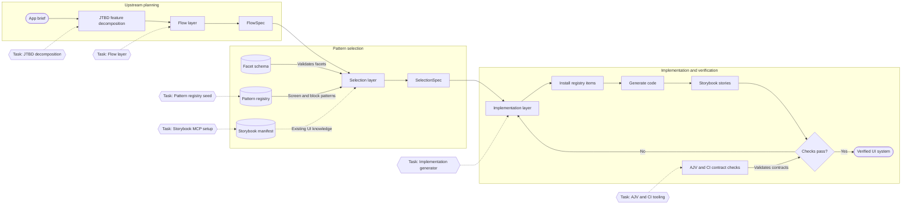

# AIデザインシステムのフローとタスク

最終確認日: 2026-07-06

FigJam図:

- https://www.figma.com/board/3zN11IrrGLMBSY61fRnQam?utm_source=codex&utm_content=edit_in_figjam&oai_id=&request_id=7df05ce9-ff8d-44a5-9304-09c6e3c47a5d

## スキル利用判断

この図作成タスクは `figma-generate-diagram` スキルに適合した。理由は、求められている成果物がシステムパイプラインとタスク依存関係のflowchartだったためである。生成されたFigJam図は編集可能である。

Storybookは図の生成には使っていない。Storybookは下流のimplementation / verification layerで使う。

## 現在のシステムフロー

## 既知の残タスク

### 穴1: Flow layer

app briefと分解済みjobを、具体的な `FlowSpec` に変換する上位レイヤーを作る。

必要な出力:

- `flowId`
- `flowArchetype`
- 順序付き `steps`
- stepごとのfacets
- transitions
- assumptions
- unresolved decisions

受け入れ条件:

- Selection layerが広いapp briefを受け取らない。
- Selection layerがuser journeyを決定しない。
- すべてのflow stepが `screenType` を解決できるだけのfacetsを持つ。

### 穴2: JTBD feature decomposition

app goalを、jobs、user tasks、objects、feature candidatesに分解する層を作る。これはflow設計より前に行う。

必要な出力:

- primary users
- jobs-to-be-done
- task list
- domain objects
- data shapes
- interaction needs
- risk / accessibility constraints

受け入れ条件:

- Flow layerがJTBD outputからflow stepsを導ける。
- feature decompositionの段階でUI componentを早期選定しない。
- JTBD outputが `userIntents`、`dataShapes`、`interactionModels` にきれいに対応する。

### 穴3: Machine contract enforcement

すべての機械契約に対して、AJVとCI validationを追加する。

検証対象の契約:

- `meta.aiDesignSystem`
- `FlowSpec`
- `SelectionSpec`
- registry item structure
- story coverage metadata
- task status metadata

受け入れ条件:

- enum外の値がCIで失敗する。
- required fields不足がCIで失敗する。
- SelectionSpecが未知のscreen/block pattern IDを参照できない。
- implementation前にregistry item dependenciesが検査される。

## 追加で必要なタスク

### Task 4: FlowSpec schemaの定義

`docs/flow-spec.schema.json` を作成する。

理由:

- Selection layerは `FlowSpec` を入力契約として依存する。
- schemaがないと、Flow layerとSelection layerが静かにズレる。

### Task 5: SelectionSpec schemaの定義

`docs/selection-spec.schema.json` を作成する。

理由:

- `SelectionSpec` はselectionからimplementationへのhandoffである。
- 選定されたscreens、blocks、scores、rejected alternatives、risks、unresolved entriesを強制する必要がある。

### Task 6: Canonical screen profileのデータ化

proseで書かれたcanonical screen profilesを、たとえば `registry/profiles/screen-profiles.json` のようなデータに移す。

理由:

- Selection layerは `screenType` を機械的に解決すべきである。
- prose tableは人間には便利だが、scoringにはstructured dataのほうがよい。

### Task 7: Pattern registry seed

screen patternとblock patternの最初のinternal registry itemsを作る。

最小seed:

- `screenType` ごとに10 screen patterns
- `blockRole` ごとに30 block patterns
- それぞれ `composition.requiredBlocks`、`stateCoverage`、`evidence`、`risk` を持つ

理由:

- internal canonical patternsが存在するまで、Selection layerは信頼できる選択肢を持てない。

### Task 8: Registry dependency resolver

選定されたregistry itemsを以下に展開するresolverを作る。

- shadcn dependencies
- npm dependencies
- external registry URLs
- file targets
- install order
- conflicts

理由:

- SelectionSpecはdependenciesを情報として列挙するだけである。
- Implementation layerには決定的なinstall planが必要である。

### Task 9: Implementation layer

`SelectionSpec` を消費してcodeを生成する層を作る。

責務:

- registry itemsをinstallする
- screen filesをcomposeする
- block filesをcomposeする
- 不足するglue codeを生成する
- shadcnのownership styleを保つ
- 宣言済みdependencies外のcomponentを選定しない

### Task 10: Storybook setup

Storybookをprojectに追加し、story generation conventionsを定義する。

必要なcoverage:

- screen stories
- block stories
- default / loading / empty / error / permission-denied states
- 関連する場合のmobileとdark mode
- 意味のあるuser flowに対するinteraction tests
- accessibility checks

理由:

- Storybook manifestsとMCPは、今後のAI作業における再利用可能なknowledge sourceになる。
- Storybook testsはimplementation後のfeedback loopになる。

### Task 11: Storybook MCP setup

Storybookが存在した後に、Storybook MCP addonをinstall / configureする。

理由:

- Storybook MCPは、agentにdocs、story generation help、previews、test-running hooksを提供する。
- 意味のあるstoriesとcomponent docsが揃う前にinstallしても効果が薄い。

### Task 12: State coverage policy

screen typeとdata-driven blocksごとに、必須stateを定義する。

baseline:

- data-driven screensは default / loading / empty / error / permission-denied を必須にする
- formsは default / validation-error / submitting / success / error を必須にする
- AI screensは関連する場合 streaming / error / human-review / explainability を必須にする

### Task 13: Accessibility policy

keyboard、focus、labels、contrast、ARIA/APG、RTL、i18nについて明確なrequirementsを作る。

理由:

- 現在のfacetsにはaccessibility fieldsがあるが、pass/fail criteriaがまだない。

### Task 14: Evidence and risk scoring

maturity、source confidence、external registry riskをmachine-readableにする。

理由:

- Selection rulesはevidence confidenceに依存する。
- community registry itemsはinternal canonical itemsと別扱いにする必要がある。

### Task 15: Task registry

たとえば `docs/system-tasks.json` のようなmachine-readable task listを作る。

含める項目:

- task ID
- title
- layer
- status
- dependencies
- acceptance criteria
- owner notes

理由:

- システムが複数の依存レイヤーを持つようになった。
- structured task registryにより、隠れた作業がprose内に埋もれにくくなる。

### Task 16: End-to-end golden flow

invoice managementなど、1つの完全なexampleを実装する。

期待するchain:

1. app brief
2. JTBD output
3. FlowSpec
4. SelectionSpec
5. registry install plan
6. generated UI
7. Storybook stories
8. AJV and CI checks

理由:

- 1つのgolden pathは、すべてのpatternを先に完成させるより早く契約不足を露出させる。

## 情報源メモ

- Storybook MCPは、設定されていればagentがcomponents/docsを理解し、stories生成、tests実行、accessibility checksを使えるようにする。
- Storybook manifestsとMCPは、現時点ではpreviewかつReact-focusedとして文書化されている。
- JSON Schemaは共有validation contractsに適している。
- AJVはJavaScript/TypeScriptのJSON Schema validationに適しており、schemaをoptimized JavaScriptへcompileできる。
- 現在のlocal docsでは `meta.aiDesignSystem`、`FlowSpec`、`SelectionSpec`、facetsを定義しているが、FlowSpecとSelectionSpecのschemaはまだ存在しない。

## Sources

- Storybook MCP overview: https://storybook.js.org/docs/ai/mcp/overview
- Storybook manifests: https://storybook.js.org/docs/ai/manifests
- AJV: https://ajv.js.org/
- JSON Schema: https://json-schema.org/
- Local research: `docs/ai-design-system-research.md`
- Local selection instructions: `docs/ai-pattern-selection-instructions.md`
- Local facet schema: `docs/ai-design-facets.schema.json`
