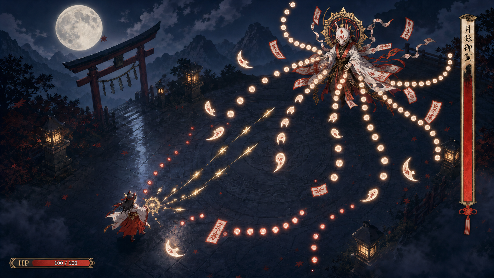

<!-- encoding:UTF-8 -->

# 2D 弾幕アクション: ゲームプレイ画面・Web実装仕様

- 日付: 2026-08-03
- 更新: 2026-08-04
- 状態: 画面デザイン確定 / 新アーケードアプリの初期収録ゲーム / ゲーム内容は未決
- 所属workspace: `apps/arcade`（実装開始時に新設）
- basePath: `/react-shadcn/arcade`
- 対象: PCブラウザ向け、16:9のゲームプレイ中画面
- 実装原則: Unityを使わず、Web技術だけで開発・配信できること

## この文書の役割

確定したゲームプレイ画面を、Webで再現可能な描画レイヤー、アセット、HUD、アニメーション、
性能条件へ分解する。ゲームルール、操作、勝敗条件、ステージ数、ボス数、報酬はここでは決めない。

このゲームはTeam Tへ追加しない。API Arcadeの3Dマップ基盤を再利用して作る独立アプリに、
Neon Tunnelと並ぶ初期ゲームとして収録する。アプリ全体の境界は [README.md](README.md) を正本とする。

## ビジュアルターゲット



この画像は完成品の一枚絵ではなく、構図、色、情報量、HUDの位置、弾の視認性を判断する正本とする。
実装時に画像全体を背景として貼らない。以降のレイヤー構成へ分解して再現する。

## 確定事項

### 画面とアート方向

- 16:9の横画面。基準レイアウトは `1920 x 1080`。
- 月夜の神社、濡れた石畳、鳥居、灯籠、霧、山影を使う和風アニメ調。
- 色の中心は濃紺、朱、象牙、金。背景は低彩度、攻撃とHUDは高コントラストにする。
- 視点は斜め上からの固定俯瞰。プレイヤーを左下、ボスを右上に置く対角構図。
- ボスをフル手描きアニメーションにしない。静止画パーツの平行移動、回転、拡縮で生命感を作る。
- 弾は少数の共通スプライトを反復し、軌道、回転、拡縮、色で変化を作る。

### HUD

- 右端に縦型のボスHPバーを表示する。
- ボス名は固定画像へ焼き込まず、ボスデータから実行時に差し替える。
- 左下にプレイヤーの横型HPバーを表示する。
- プレイヤーHPは現在値と最大値を表示できる。
- 右下の円形ゲージは採用しない。
- 左上の倍率・スコア・筆文字表示は採用しない。
- 炎4個によるプレイヤー残機・HP表示は採用しない。
- 現段階では、上記2本以外のHUDを追加しない。

## 基準座標とスケーリング

| 項目               | 仕様                                                                  |
| ------------------ | --------------------------------------------------------------------- |
| デザイン座標       | `1920 x 1080`                                                         |
| 推奨内部描画解像度 | `1280 x 720`                                                          |
| 表示方法           | アスペクト比を保った `contain`。余白は濃紺〜黒のレターボックス        |
| HUD安全域          | 各辺からデザイン座標で64px。ただし右ボスバーは右端専用レールを使用    |
| 座標変換           | 当たり判定と描画は内部座標で統一し、CSS表示倍率をゲーム座標へ混ぜない |

画面幅が狭い場合もゲーム領域の縦横比を変えない。HUDをDOMリフローで移動させず、
同じゲーム座標系の中で一括スケールする。

## 描画レイヤー

奥から手前へ次の順序で描く。

| 順序 | レイヤー     | 内容                           | 動き                             |
| ---: | ------------ | ------------------------------ | -------------------------------- |
|    0 | 背景遠景     | 月、空、雲、山影               | 月は固定。雲のみ低速移動         |
|    1 | 背景中景     | 鳥居、樹木、遠い灯籠           | カメラ移動時だけ弱いパララックス |
|    2 | アリーナ     | 石畳、円形紋様、濡れた反射     | 基本固定。反射強度だけ微変化可   |
|    3 | 環境前景     | 近い灯籠、霧、少量の紅葉       | 霧と葉だけ低速移動               |
|    4 | キャラクター | プレイヤー、ボス、ボス装飾     | パーツアニメーション             |
|    5 | 攻撃物       | 敵弾、プレイヤー弾             | プログラム生成                   |
|    6 | 戦闘VFX      | 発光、被弾、残像、短い画面振動 | 必要時だけ表示                   |
|    7 | HUD          | プレイヤーHP、ボス名・HP       | ゲーム状態へ追従                 |

全画面ブラーや常時色収差は使わない。背景の情報量を増やすより、戦闘領域の局所コントラストを守る。

## アセット分割

### 背景

初期実装では次の3〜4枚に留める。

- `bg-far.webp` — 月、空、雲、山影を含む不透明遠景
- `bg-mid.webp` — 鳥居、樹木、遠い灯籠。透過が必要ならWebP/PNG
- `arena.webp` — 石畳と円形紋様。不透明
- `fg-atmosphere.webp` — 必要な場合だけ、近景の霧・樹木シルエット

静止画へ焼き込める装飾は分割しない。動かす必要がある物だけ別素材にする。

### ボス

ボスは1体を次のパーツへ分け、原点を共有する。

- 胴体・仮面のコア1枚
- 後光1枚
- 左右の袖2枚
- 左右の布尾2枚
- 髪または背面飾り1枚
- 浮遊する御札6枚まで。御札画像自体は1〜2種類を使い回す

ボス専用のフルフレーム連番は作らない。各パーツに小さな回転、上下動、遅延を与える。

### プレイヤー

- 待機・移動を含めて4〜8フレームの小さなスプライトアニメーションを上限とする。
- 髪、袖、リボンの揺れは、本体スプライトと分ける場合でも3パーツ以内にする。
- プレイヤー中心と当たり判定中心が視覚的に一致するよう、足元または身体中心に小さな焦点表現を置く。

### 弾とVFX

敵弾は次の3系統を基本とする。

1. 象牙色の小光球
2. 朱印付きの御札
3. 三日月または花弁形の弾

同じテクスチャを回転、拡縮、色調整して使う。弾ごとの手描きアニメーションは作らない。
プレイヤー弾は細い金色の直線・槍形を基本とする。

## アニメーション予算

| 対象       | 方法                             | 上限の目安               |
| ---------- | -------------------------------- | ------------------------ |
| 背景       | パララックス、UV移動、透明度変化 | 常時3系統まで            |
| ボス       | パーツごとのtransform            | 8パーツ程度              |
| プレイヤー | スプライトシート                 | 4〜8フレーム             |
| 御札・布   | sin波による揺れ、回転            | 同じ式へ位相差を付ける   |
| 弾         | 座標・角度・拡縮                 | オブジェクトプールで管理 |
| 被弾VFX    | 発光、短い残像、画面振動         | 150〜250ms程度           |

「キャラクターを大きく動かす」のではなく、後光、袖、布、御札、霧、発光の位相をずらし、
画面全体が呼吸しているように見せる。

## HUD詳細

### ボスHP

右端専用レールへ置き、戦闘領域と重ねない。

| 項目     | デザイン座標での基準                   |
| -------- | -------------------------------------- |
| 右余白   | 32〜48px                               |
| 全体幅   | 56〜72px                               |
| 全体高さ | 650〜760px                             |
| HP方向   | 下端固定。ダメージで上から下へ空になる |
| 名前     | 縦書き。装飾枠と文字を別要素にする     |
| 色       | 象牙・金の枠、朱の残量、墨色の欠損部   |

ボス名は次の状態から描画する。

```ts
type BossHudState = {
  displayName: string
  hp: number
  maxHp: number
  visible: boolean
}
```

- `displayName` は画像URLやCSSクラスへ変換せず、文字列として描画する。
- 改行、制御文字、HTMLは除去する。
- 10書記素を目安に収め、長い場合はフォント縮小後に末尾を省略する。
- `maxHp <= 0` の場合はゼロ除算せず、ゲージを空として扱う。

### プレイヤーHP

左下の安全域へ置く。

| 項目   | デザイン座標での基準                 |
| ------ | ------------------------------------ |
| 左余白 | 36〜48px                             |
| 下余白 | 28〜40px                             |
| 幅     | 300〜340px                           |
| 高さ   | 34〜42px                             |
| 表示   | `HP`、残量バー、`current / max`      |
| 色     | 象牙・金の枠、朱の残量、濃紺の欠損部 |

```ts
type PlayerHudState = {
  hp: number
  maxHp: number
  visible: boolean
}
```

HP変化は状態更新と即座に同期する。視覚上の遅延バーを追加する場合も、数値は実値を表示する。

## Web実装境界

- Unity、Unity WebGL出力、C#ランタイムへ依存しない。
- ゲームループ、入力、描画、当たり判定はCanvas/WebGL上で完結させる。
- React/Next.jsを使う場合、ページと起動導線だけを担当させ、毎フレームの弾やキャラクターを
  Reactコンポーネントとして更新しない。
- 第一候補は Phaser + TypeScript。描画を独自設計する必要が出た場合だけ PixiJS を再検討する。
- 本番はWebGLを基準とし、WebGPU固有機能へ依存しない。
- 外部CDNからスクリプト、フォント、ゲーム画像を読み込まない。必要な依存は同一オリジンへ同梱する。
- サーバー処理を前提にせず、静的ホスティングで起動できる成果物にする。

新アプリは、Team Tのコイン・報酬・APIカタログを引き継がない。ゲーム表示とロビー復帰に必要な
共通ランタイム契約は、新アプリのNeon Tunnel vertical sliceを通して固定する。

## パフォーマンス予算

初期目標は一般的なデスクトップブラウザで安定した60fpsとする。

- 内部解像度: 基本 `1280 x 720`。高DPIでも無制限にピクセル数を増やさない。
- 可視敵弾: まず800個を上限として設計し、実機計測後に変更する。
- 弾の生成・破棄: 毎フレーム行わず、オブジェクトプールを使う。
- テクスチャ: 背景以外は可能な限りアトラスへまとめる。
- 合成モード: 通常と加算を頻繁に往復しないよう描画順をまとめる。
- 全画面ポストエフェクト: 原則1つまで。常時ブラーは禁止。
- 1フレーム内の新規配列・オブジェクト生成を避ける。
- 初回ロード用アセット: 圧縮後15MB未満を目標とし、実装開始後に計測値を記録する。

性能が不足した場合は、画質ではなく次の順で削減する。

1. 画面外の弾とVFXを更新・描画しない
2. 霧・紅葉など非戦闘パーティクルを減らす
3. 弾の発光レイヤーを簡略化する
4. 内部描画解像度を下げる

弾の輪郭、プレイヤー位置、当たり判定の視認性は最後まで削らない。

## 視認性とアクセシビリティ

- 敵弾は背景との明度差だけでなく、形と縁取りでも区別する。
- プレイヤー弾は金、敵弾は象牙・朱を中心とし、色だけに依存しない。
- ボス、弾、プレイヤーが重なる場合、プレイヤーの輪郭を最優先する。
- 画面振動は短くし、将来OFF設定を追加できる構造にする。
- 強いフラッシュを連続させない。被弾フラッシュは局所的かつ短時間にする。

## 実装順序

1. **静止構図** — 背景3層、アリーナ、仮プレイヤー、仮ボス、確定HUDを配置する。
2. **HUD vertical slice** — ボス名差し替え、両HPバー更新、境界値をテストする。
3. **弾幕描画** — 3種類の弾、オブジェクトプール、画面外回収を実装する。
4. **低コストアニメーション** — ボスパーツ、プレイヤー、霧、葉を順に追加する。
5. **VFXと音** — 被弾、発射、残像を必要最小限で追加する。
6. **性能調整** — 60fps、ロード量、メモリ、長時間稼働を実機で確認する。
7. **ロビー統合** — 新アプリの共通ゲームランタイムへ接続し、終了後に3Dロビーへ戻す。

## 受け入れ条件

- `1920 x 1080`でビジュアルターゲットと同じ対角構図、色、情報密度に見える。
- 右端に縦型ボスHPバーがあり、ボス名をゲーム再起動なしで差し替えられる。
- 左下にプレイヤーHPバーがあり、現在値と最大値が正しく反映される。
- 右下の円形ゲージ、左上の表示、炎4個、その他の未承認HUDが存在しない。
- ボスは静止画パーツのtransform中心で動き、フル手描き連番を要求しない。
- 弾は3系統の共通素材から生成され、800個表示時の性能を計測できる。
- Unityをインストール・起動・ビルドせず、Webの開発ツールだけで完了する。
- 静的ホスティングで起動し、外部CDN障害に依存しない。

## 未決事項

- ゲームのルール、操作、勝敗、制限時間、難易度
- ボスとプレイヤーの正式名称・設定
- 弾幕パターンと攻撃フェーズ
- サウンド、BGM、音量設定
- 新アプリ内で単一HTMLへインライン化するか、静的アセットを別ファイルで配信するか
- モバイル・タッチ操作をV1へ含めるか
